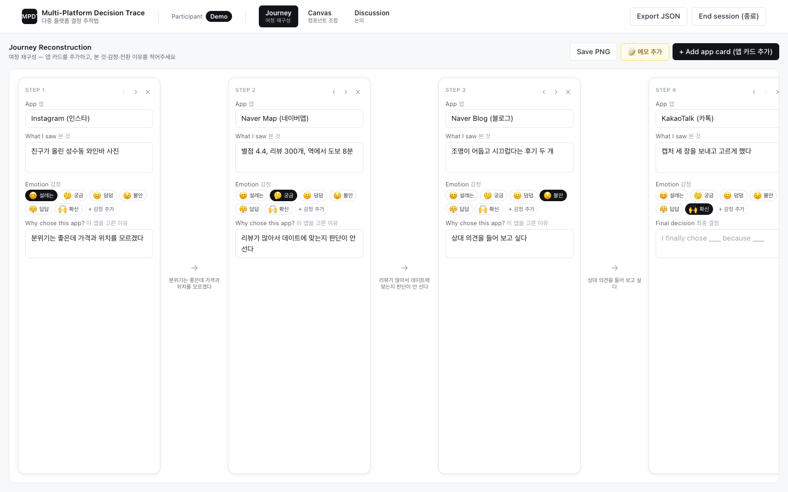
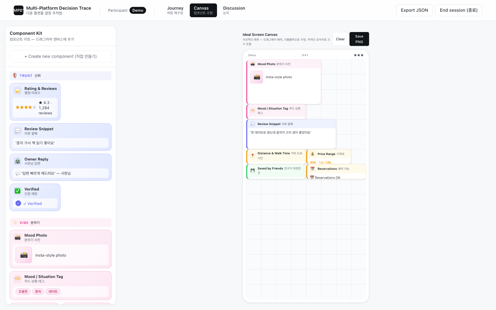
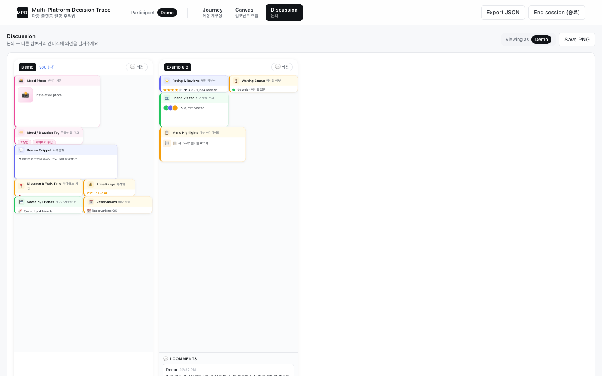

# Multi-Platform Decision Trace: A Participatory Design Toolkit for Multi-App Place Decisions

[](https://multi-platform-decision-pd.vercel.app)
[](https://react.dev/)
[](https://vitejs.dev/)
[](https://firebase.google.com/docs/firestore)

> A browser toolkit for running participatory design sessions on one question: why do people in their 20s bounce between Naver Map, Instagram and KakaoTalk before they settle on a place to eat or meet, and what would have let them decide sooner?



<sub>Journey step with an example session (not study data). Each card records the app, what the participant saw there, how they felt and why they moved on.</sub>

---

## Contents

- [Overview](#overview)
- [Why a new method](#why-a-new-method)
- [Live demo](#live-demo)
- [Session flow](#session-flow)
- [Researcher view](#researcher-view)
- [Architecture](#architecture)
- [Run locally](#run-locally)
- [Study context and team](#study-context-and-team)
- [References](#references)
- [Contact](#contact)

---

## Overview

Choosing where to go on a date rarely happens in one app. A typical search opens Naver Map for ratings, moves to Instagram for photos of the room, sends screenshots to a KakaoTalk chat, goes back to Naver Map and still ends with some doubt. No single app is built to answer the question behind all that switching: given who I am meeting and what kind of evening I want, will this place feel right?

**Multi-Platform Decision Trace (MPDT, 다중 플랫폼 결정 추적법)** is a participatory design method for studying that journey from the participant's side, and this repository is the web toolkit that runs it. In one session a participant rebuilds a recent real decision as a timeline, then builds the screen that would have helped from a kit of components, then looks at other participants' screens and comments on them. The researcher watches every artifact appear live.

The toolkit was built for the User-Centered Design course at KAIST Industrial Design (Spring 2026).

## Why a new method

The behaviour we wanted to study is spread across several apps and often over hours or days, so none of the usual methods sees all of it.

| Method | What it misses here |
|---|---|
| Usability test | Stays inside one app |
| Interview | Participants give a tidy summary and lose the moments when they got unsure |
| Diary study | Records the sequence of apps but not why each switch happened |
| Contextual inquiry | There is no single place or moment to observe |

The method follows the generative design work of Sanders, Stappers and colleagues: people often cannot say on demand what would have made them feel certain, but they can build something that shows it and then explain what they built [1, 2]. So the session first anchors participants in a real, recent decision (with their phone open to check what they actually saved, searched and sent) and only then hands them the building materials. Studies of inter-app navigation [3], of tasks that span several apps [4] and of why users switch apps during mobile search [5] are why each journey card asks what was missing at the moment of the switch.

## Live demo

**Try it:** <https://multi-platform-decision-pd.vercel.app>

Enter any name to start as a participant. The hosted demo writes to a shared database that other visitors can see, so use a throwaway name and leave out personal information. To try it privately, [run it locally](#run-locally) with your own Firebase project.

## Session flow

A session takes about 60 minutes and the interface is bilingual (English and Korean) throughout.

| Step | In the toolkit | What the participant does |
|---|---|---|
| 0 | Intro | Four short pages: a welcome, the design goal, the situation under study and the three activities |
| 1 | **Journey** (여정 재구성) | Rebuilds a recent place decision as app cards: which app, what they saw, how they felt, why they left. The last card records the final choice. Free-form memos can sit between cards. |
| 2 | **Canvas** (컴포넌트 조합) | Drags components onto a phone-sized canvas to build the screen that would have helped most, resizes them and edits their text. A blank card and "create new component" let them add what the kit lacks. |
| 3 | **Discussion** (논의) | Sees every participant's canvas side by side and leaves comments on the others' designs. |



<sub>Canvas step with the same example session. The kit has 21 components in four groups plus a blank card.</sub>

| Group | Components |
|---|---|
| Trust | Rating and review count, review snippet, owner reply, verified badge |
| Vibe | Mood photo, mood and situation tags, music, lighting, outdoor seating |
| Social | Friend visited, last visit, saved by friends, trending, group size |
| Logistics | Distance and walk time, waiting, price, opening hours, reservations, parking, menu highlights |

Emotion tags on the journey cards (excited, curious, neutral, anxious, frustrated, confident) can be extended during the session. Every step has **Save PNG**, and **Export JSON** downloads the participant's whole session.



<sub>Discussion step with two example participants.</sub>

## Researcher view

A separate researcher view runs alongside the participant screens. From there the researcher can:

- set the session topic shown to participants,
- add custom components and emotion tags that appear for everyone at once,
- follow each participant's journey, memos, canvas and comments as they are created,
- clear parts of a session or delete a participant after it ends.

## Architecture

- **React 19 and Vite**, with Tailwind CSS and `@dnd-kit` for dragging cards and components.
- **Firebase Firestore** keeps participants and the researcher in sync in real time (`src/state/firebaseSync.jsx`). Each participant is one document, and shared custom components and emotions live in one workshop document:

  ```
  participants/{participantId}   one participant's journey, canvas and comments
  workshop/global                shared custom components, emotions and topic
  ```

- **localStorage** keeps a copy of the session, so a refresh or dropped connection does not lose a participant's work.
- A single reducer store (`src/state/store.jsx`) drives the screens: `entry → intro → participant (Journey, Canvas, Discussion)`, with `admin` as a separate mode.
- `html-to-image` renders the PNG exports.

```
src/
  components/   IntroPages, NameEntry, SessionBar, AdminView
  steps/        Step2Timeline (Journey), Step3Canvas (Canvas), Step4Compare (Discussion)
  kit/          component catalog and card renderer
  state/        reducer store and Firestore sync
  utils/        JSON/PNG export, id helpers
```

## Run locally

Requires Node.js 20.19 or later (Vite 8).

```bash
git clone https://github.com/Able0401/multi-platform-decision-PD.git
cd multi-platform-decision-PD
npm install
npm run dev
```

The committed `src/firebase.js` points at the study's Firebase project. Replace `firebaseConfig` with the web config of your own Firebase project (Project settings → Your apps → Web app) and enable Firestore before running a session of your own.

## Study context and team

The method and toolkit were the participatory design project (Project 3) in the course's four-project sequence, and the toolkit was used in in-person sessions. Participants were people in their 20s who had recently planned a date, taken charge of choosing the place and used more than one app to do it. Participant data is not included in this repository.

The method was designed by a three-person course team. Hyun Seung Moon built the toolkit.

## References

1. Sanders, E. B.-N., & Stappers, P. J. (2014). Probes, toolkits and prototypes: Three approaches to making in codesigning. *CoDesign, 10*(1), 5–14. https://doi.org/10.1080/15710882.2014.888183
2. Sleeswijk Visser, F., Stappers, P. J., van der Lugt, R., & Sanders, E. B.-N. (2005). Contextmapping: Experiences from practice. *CoDesign, 1*(2), 119–149. https://doi.org/10.1080/15710880500135987
3. Ma, Y., Hu, Z., Gu, D., Zhou, L., Mei, Q., Huang, G., & Liu, X. (2020). Roaming through the castle tunnels: An empirical analysis of inter-app navigation of Android apps. *ACM Transactions on the Web, 14*(3), Article 14. https://doi.org/10.1145/3395050
4. Tian, Y., Zhou, K., Lalmas, M., & Pelleg, D. (2020). Identifying tasks from mobile app usage patterns. *Proceedings of SIGIR '20*. https://doi.org/10.1145/3397271.3401441
5. Liang, S., & Wei, Z. (2024). Understanding users' app-switching behavior during the mobile search: An empirical study from the perspective of push–pull–mooring framework. *Behavioral Sciences, 14*(11), 989. https://doi.org/10.3390/bs14110989

## Contact

Hyun Seung Moon, Ph.D. student, KAIST Industrial Design (AI Experience Lab)
[mzes0401@kaist.ac.kr](mailto:mzes0401@kaist.ac.kr) · [hyunseungmoon.net](https://hyunseungmoon.net) · [GitHub](https://github.com/Able0401)
